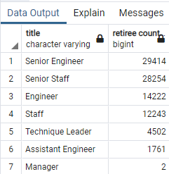
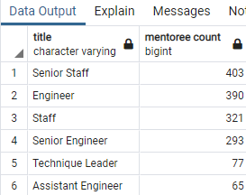

# Pewlett Hackard Analysis
## Project Overview
Our manager at Pewlett Hackard is concerned about the amount of employees nearing retirement age and has tasked us with analyzing company employee data to begin planning for the coming *"silver tsunami"*.
## Results
1. Our first task was to provide a list of employees nearing retirement age. To help our manager get a sense of which departments were going to be hit hardest, we counted the reitring employees by department. As seen below in Figure 1, there are nearly 30,000 Senior Engineers close to retiring, and almost as many Senior Staff.

2. To help counter-balance the impending retiring, our manager has proposed starting a mentorship program. He hopes that the employees retiring can train some of their juniors to ensure a smooth transition. However, when looking at the eligibility for our possible mentoring program, there is a glaring difference in the number of upcoming employees versus retiring employees, as seen in Figure 2.

 
## Summary
Based on our analysis, we can conclude that with the amount of employees near retirement could potential cause a disruption in productivtiy. And while a mentorship program would help bridge the gap by promoting some junior staff, there most likely will need to be some supplimental hiring in order to full ensure coverage.
